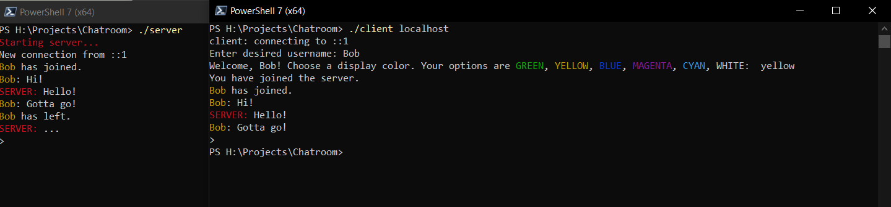

# About
Concise chatroom exercise using C sockets.

Multiple users can connect to a server and chat with each other. Each user can choose a username and a color for that username to be displayed in.

# Building
Simply run make.

Requires GCC on Unix or Cygwin for Windows.
